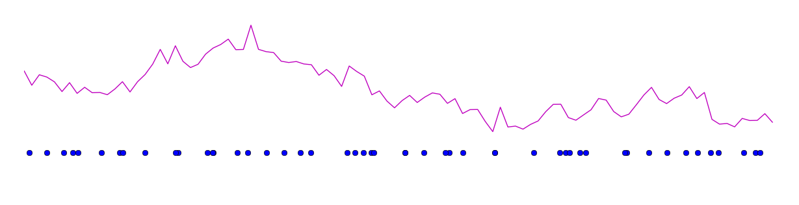

# plotspikes.py
A minimal python function for beautiful spike plotting because spikes should be plotted like this:
```python
plotspikes(spiketimes) # see example.py
```


And **not** like this:
```python
plt.plot(spiketimes, -2.5 * np.ones(len(spiketimes)), 'o') # see ugly.py
```

